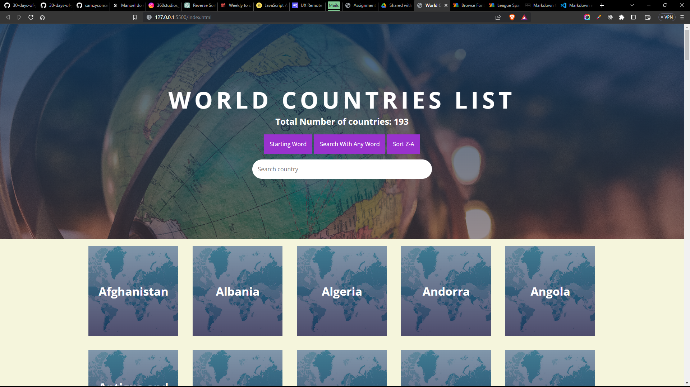
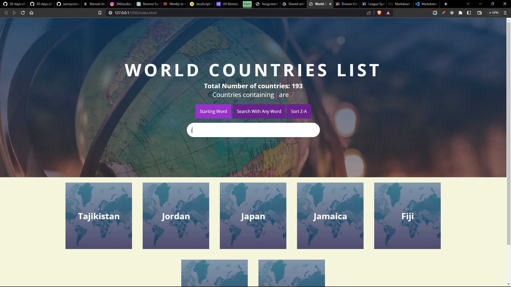

# 💻 World countries data visualization

1. Visualize the country array as follows

## Solution

|                       Project - Visualization of Countries Data                        |
| :------------------------------------------------------------------------------------: |
|                                                   |
|                                             |
|                                                                                        |
| Live Preview [Here 🌐](https://samzyconcepts.github.io/world-countries-visualization/) |
